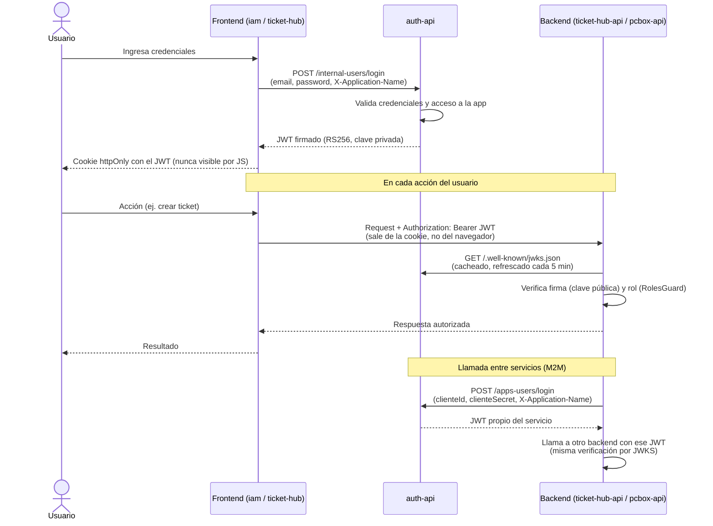

# jtagram

Este repositorio contiene las convenciones que guían a la IA en el desarrollo del ecosistema jtagram: frontend, backend e infraestructura. Acá **no** vive código de los proyectos — cada uno vive en su propio repositorio, clonado como carpeta hija de esta.

## Proyectos

- **auth-api** — backend que gestiona la autenticación y autorización de todo el ecosistema: usuarios internos y usuarios de aplicación, emisión y verificación de JWT. [Más información](https://github.com/jhonny-berdeja/auth-api)
- **iam** — frontend para administrar accesos: usuarios internos, usuarios de aplicación, roles y las aplicaciones registradas en `auth-api`. [Más información](https://github.com/jhonny-berdeja/iam)
- **infra-hub** — repositorio centralizado con los manifiestos de Kubernetes y los pipelines de deploy de todas las apps del ecosistema. [Más información](https://github.com/jhonny-berdeja/infra-hub)
- **pcbox-api** — backend que ejecuta, de forma controlada y auditable, tareas administrativas (playbooks de Ansible) sobre el servidor físico `pcbox`. [Más información](https://github.com/jhonny-berdeja/pcbox-api)
- **posts** — backend en etapa inicial, todavía sin funcionalidad de negocio propia. [Más información](https://github.com/jhonny-berdeja/posts)
- **ticket-hub** — frontend de la ticketera, desde donde se crean y gestionan tickets para solicitar gestión de `pcbox`, bases de datos y Kubernetes. [Más información](https://github.com/jhonny-berdeja/ticket-hub)
- **ticket-hub-api** — backend de la ticketera: expone la API de tickets y coordina con `pcbox-api` la ejecución de las administraciones aprobadas. [Más información](https://github.com/jhonny-berdeja/ticket-hub-api)

## Autenticación y autorización entre apps

La autenticación y autorización del ecosistema están centralizadas en `auth-api`, el único servicio que tiene la clave privada RSA. Firma JWT (RS256) tanto para personas —usuarios internos, vía `POST /internal-users/login`— como para aplicaciones que actúan como clientes machine-to-machine —usuarios de aplicación, vía `POST /apps-users/login`—, validando en ambos casos que la aplicación que pide el login (header `X-Application-Name`) tenga acceso concedido a ese usuario. El resto de los servicios (`ticket-hub-api`, `pcbox-api`, `iam`, etc.) nunca ven esa clave privada ni le consultan a `auth-api` en cada request: `auth-api` publica su clave pública en `GET /.well-known/jwks.json`, cada backend la cachea (refrescándola cada 5 minutos) para verificar localmente la firma y vigencia de cada JWT, y usa el rol incluido en el token para autorizar o rechazar la operación. Cuando una app necesita llamar a otra —por ejemplo `ticket-hub-api` a `pcbox-api`, para ejecutar una administración ya aprobada— se comporta como un usuario de aplicación más: se loguea a sí misma contra `auth-api` con sus propias credenciales (`clienteId`/`clienteSecret`) y adjunta el JWT resultante en la llamada, exactamente igual que lo haría un usuario humano autenticado desde un frontend.

## Agregar un proyecto nuevo

Siempre que se agregue un nuevo proyecto al ecosistema jtagram —clonado dentro de esta carpeta— hay que agregarlo al `.gitignore` de este repositorio.
